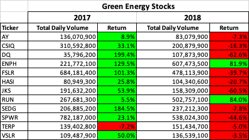
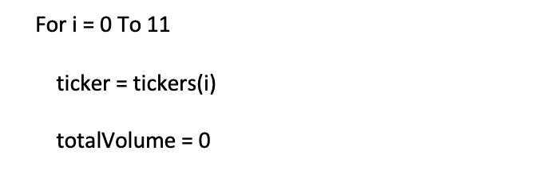
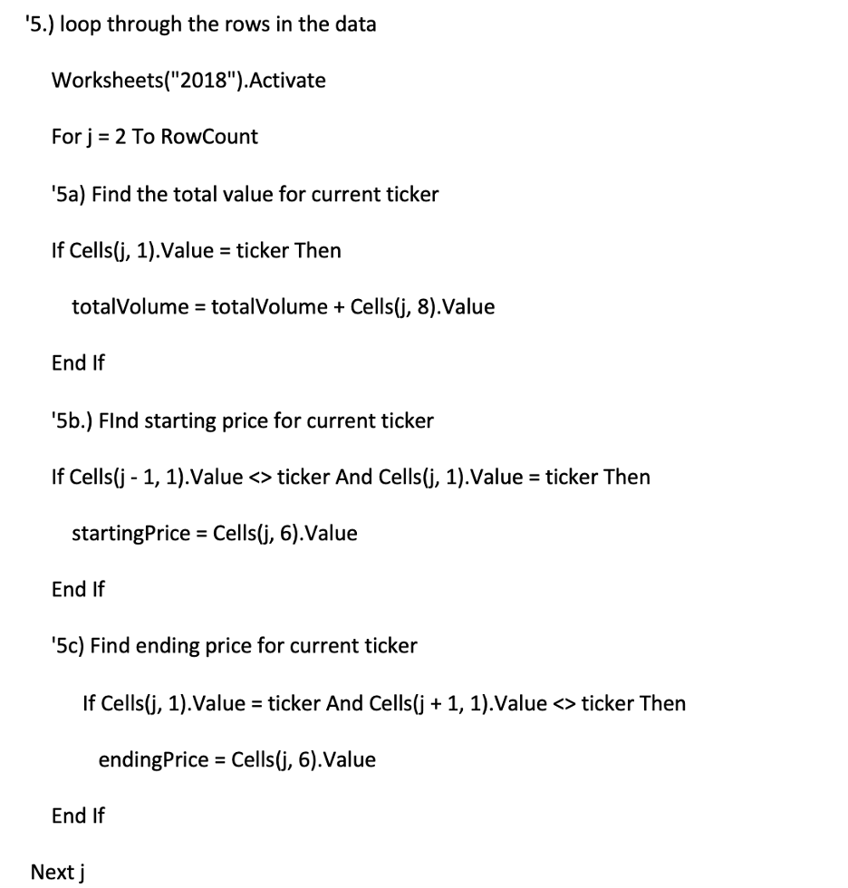
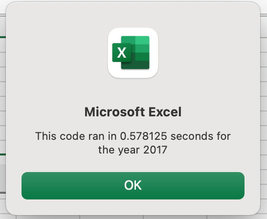
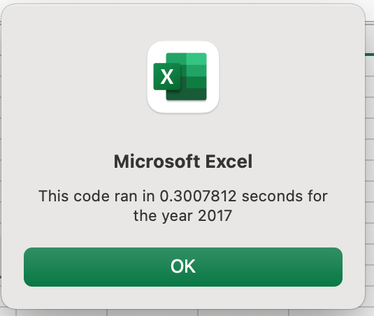
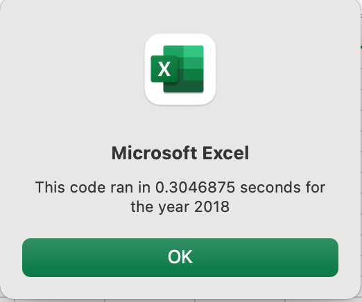

# VBA Challenge using Analysis of Stock Data

## Overview

This project analyzes data for 12 stocks related to Green Energy Companies to calculate their returns during the years 2017 and 2018. A VBA script utilizing nested loops was developed to find total volume and starting and ending price to produce a return percent. Next the same analysis was done after refactoring the VBA code to remove the nested loop design and implement an index design. A summary of the stocks performance as well as execution performance of the VBA scripts is presented here.

## Results

### Stock Performance

The table below compares the years of 2017 and 2018 for each stock in terms of Total Volume and Yearly Return. The negative returns are highlighted in red and the postive returns are highlighted in green. With this formatting, it is apparent that the year of 2017 was a better year for green stocks than 2018. With such a drastic change from one year to the next, during this time period green stocks represent a risky investment. Further analysis since 2018 is necessary to determine their stability. 

### Execution Performance

The first analysis of this data was executing utilizing a VBA script designed with nested loops. The outer loop cycled through the tickers identified for each stock. The code to perform this is pictured below.

Then an inner loop was created to mine the data for each unique ticker calculating the total volume and determining the ending price and the starting price to calculate the yearly return. This code is pictured below. 

The execution time to perform this analysis for each year is shown in the pictures below. 

     

The second analysis produced the same output but the code was refactored to replace the nested loops with an index design. First a ticker index was defined and 3 output arrays were defined for the total volume, starting price, and ending price. Then these arrays were matched to the tickers by their ticker index. This eliminates the need for the outer loop. 

<insert pic>

The execution time to perform the redesign for each year is shown in the pictures below. 

     

## Summary

### Advantages of Refactoring

**Refactoring** refers to the process of restructing computer code without changing its functionality [@https://en.wikipedia.org/wiki/Code_refactoring]. The most obvious advantage of refactoring is by improving the structure to be more straightforward, it naturally makes it easier to work with. Consequently, int he case of bugs, they can be identified more readily and remedied. If the code is written in a design pattern, then it could be adapted to another project or easily extended to the current project to do deeper analyses. Moreover, if the code is written in an efficient manner it could reduce the processing time. [@https://anarsolutions.com/code-refactoring-concept-analysis/]

### Disadvantages of Refactoring

While refactoring can offer advantages, it also has a down side. Refactoring can be very time-consuming and could potentially introduce bugs into a script that was working previously. [@https://anarsolutions.com/code-refactoring-concept-analysis/]
